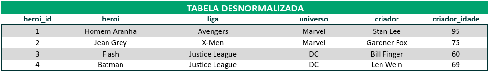

## Descrição das Atividades
 

### 1. Converta a tabela desnormalizada abaixo para a 1ª Forma Normal.

 

### 2. Converta a tabela desnormalizada abaixo (que já está nos padrões da 1ª Forma Normal) para a 2ª Forma Normal.

 

### 3. Agora, converta essa outra tabela (que já está nos moldes das duas primeiras formas) para a 3ª Forma Normal.

