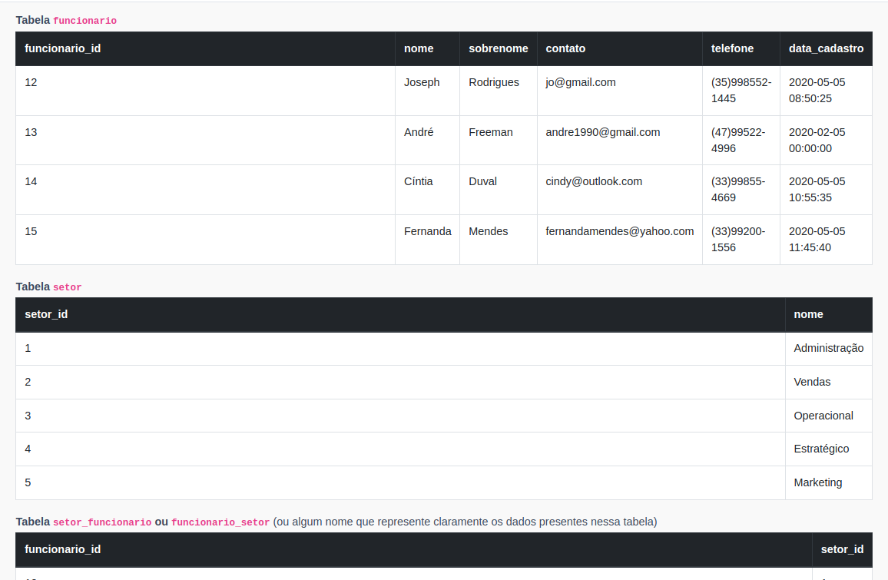

### 1. 
~~~
1ª Forma Normal
* Colunas devem possuir apenas um valor
* Valores em uma coluna devem ser do mesmo tipo de dados
* Cada coluna deve possuir um nome único
* A ordem dos dados não deve afetar a integridade dos dados
~~~

 

### 2. 
~~~
2ª Forma Normal
* Tabela deve estar na 1ª Forma Normal
* A tabela não deve possuir dependências parciais
~~~

 

### 3. 
~~~
CREATE DATABASE IF NOT EXISTS normalization;
USE normalization;

CREATE TABLE setor(
    setor_id INT primary key,
    nome VARCHAR(100)
) engine=InnoDB;

INSERT INTO setor(setor_id, nome) VALUES(1, 'Administração');
INSERT INTO setor(setor_id, nome) VALUES (2, 'Vendas');
INSERT INTO setor(setor_id, nome) VALUES(3, 'Operacional');
INSERT INTO setor(setor_id, nome) VALUES(4, 'Estratégico');
INSERT INTO setor(setor_id, nome) VALUES(5, 'Marketing');

CREATE TABLE funcionario(
    funcionario_id INT primary key,
    nome VARCHAR(100),
    sobrenome VARCHAR(100),
    contato VARCHAR(100),
    telefone VARCHAR(100),
    data_cadastro VARCHAR(100)
) engine=InnoDB;

INSERT INTO funcionario(funcionario_id, nome, sobrenome, contato, telefone, data_cadastro) VALUES(12, 'Joseph', 'Rodrigues', 'jo@gmail.com', '(35)998552-1445', '2020-05-05 08:50:25');
INSERT INTO funcionario(funcionario_id, nome, sobrenome, contato, telefone, data_cadastro) VALUES(13, 'André', 'Freeman', 'andre1990@gmail.com', '(47)99522-4996', '2020-02-05 00:00:00');
INSERT INTO funcionario(funcionario_id, nome, sobrenome, contato, telefone, data_cadastro) VALUES(14, 'Cíntia', 'Duval', 'cindy@outlook.com', '(33)99855-4669', '2020-05-05 10:55:35');
INSERT INTO funcionario(funcionario_id, nome, sobrenome, contato, telefone, data_cadastro) VALUES(15, 'Fernanda', 'Mendes', 'fernandamendes@yahoo.com', '(33)99200-1556', '2020-05-05 11:45:40');

CREATE TABLE funcionario_setor(
    funcionario_id INT NOT NULL,
    setor_id INT NOT NULL,
    foreign key (funcionario_id) references funcionario(funcionario_id),
    foreign key (setor_id) references setor(setor_id)
) engine=InnoDB;

INSERT INTO funcionario_setor(funcionario_id, setor_id) VALUES(12, 1);
INSERT INTO funcionario_setor(funcionario_id, setor_id) VALUES(12, 2);
INSERT INTO funcionario_setor(funcionario_id, setor_id) VALUES(13, 3);
INSERT INTO funcionario_setor(funcionario_id, setor_id) VALUES(14, 4);
INSERT INTO funcionario_setor(funcionario_id, setor_id) VALUES(14, 2);
INSERT INTO funcionario_setor(funcionario_id, setor_id) VALUES(15, 5);
~~~
