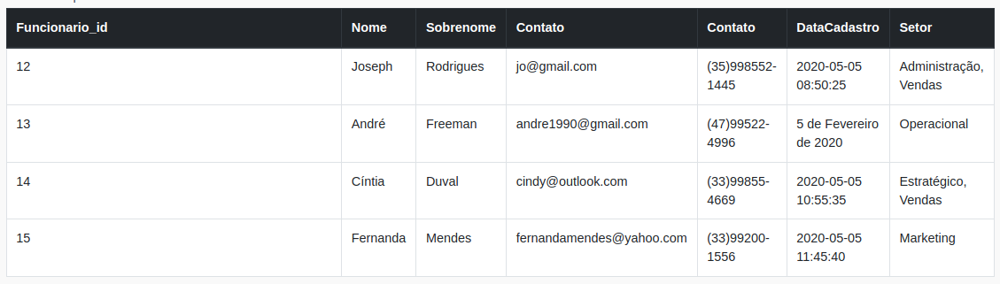

## Descrição das Atividades
 

### 1. Normalize a tabela a seguir para a 1ª Forma Normal. Não se preocupe em montar a estrutura em código SQL neste primeiro momento. Crie apenas uma planilha (Excel, Google Sheets, Open Office Calc ou semelhantes) da estrutura esperada.

### 2. Usando a estrutura (já normalizada para 1ª Forma Normal) da tabela anterior, transforme-a agora na 2ª Forma Normal.
### 3. Monte uma query que:
* Crie um banco de dados chamado normalization ;
* Crie todas as tabelas resultantes do exercício 2 (na 2ª Forma Normal);
* Popule todas as tabelas com os dados fornecidos nos exercícios.