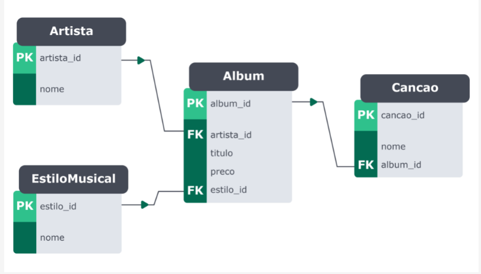

## Descrição da Atividade
 

### Crie um banco de dados com as seguintes informações

#### As informações a serem armazenadas sobre cada album são:
* Título;
* Preço;
* Estilo Musical;
* Canções.

#### Identificação das Entidades :
* Entidade 1: Álbum ;
* Entidade 2: Artista ;
* Entidade 3: Estilo Musical ;
* Entidade 4: Canção ;
<bn>

#### Identificação dos Atributos :
* Álbum: album_id , titulo , preco , estilo_id e artista_id ;
* Artista: artista_id e nome ;
* Estilo Musical: estilo_id e nome ;
* Canção: cancao_id , nome e album_id ;
 

#### Identificação dos Relacionamentos :
* Um artista pode possuir um ou mais álbuns;
* Um estilo musical pode estar contido em um ou mais álbuns;
* Um álbum pode possuir uma ou mais canções;
 

Relacionamento detalhado entre tabelas
 

Diagrama de relacionamentos do banco de dados `Àlbuns`
