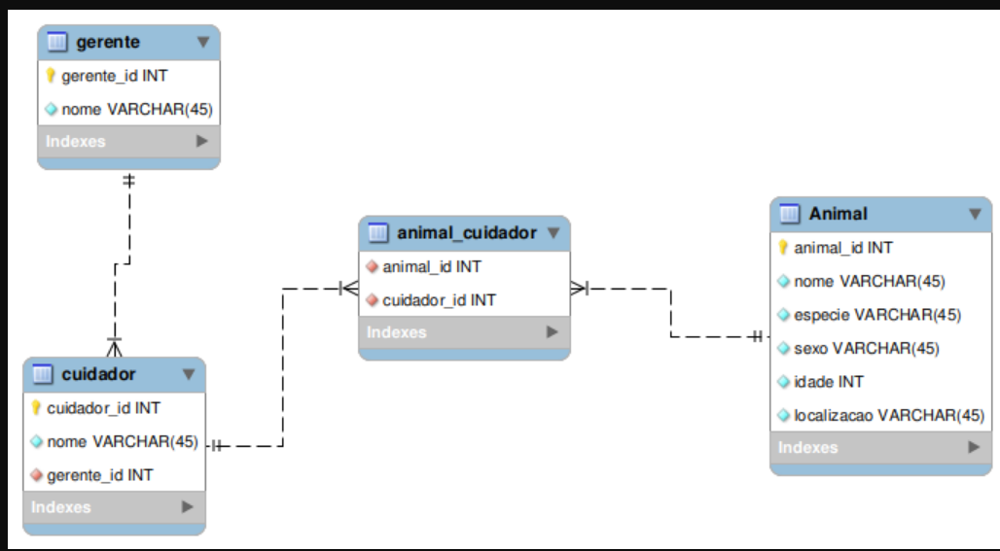

## Descrição da Atividade
 

### Crie um banco de dados com as seguintes informações

#### As informações a serem armazenadas sobre cada animal são:
* Nome;
* Espécie;
* Sexo;
* Idade;
* Localização;

#### Identificação das Entidades :
* Entidade 1: Animal ;
* Entidade 2: Cuidador ;
* Entidade 3: Gerente ;
* Entidade 4: Cuidador e Animal ;
<bn>

#### Identificação dos Atributos :
* Animal: animal_id , nome , especie , sexo , idade e localização ;
* Cuidador: cuidador_id , nome , gerente_id ;
* Gerente: gerente_id e nome ;
* Cuidador e Animal: cuidador_id e animal_id ;
 

#### Identificação dos Relacionamentos :
* Um animal pode ter um ou mais cuidadores;
* Um cuidador pode cuidar de um ou mais animais;
* Um gerente pode gerenciar uma ou mais cuidadores;
* Um cuidador possui um gerente;
 

Relacionamento detalhado entre tabelas
 

Diagrama de relacionamentos do banco de dados `Àlbuns`
